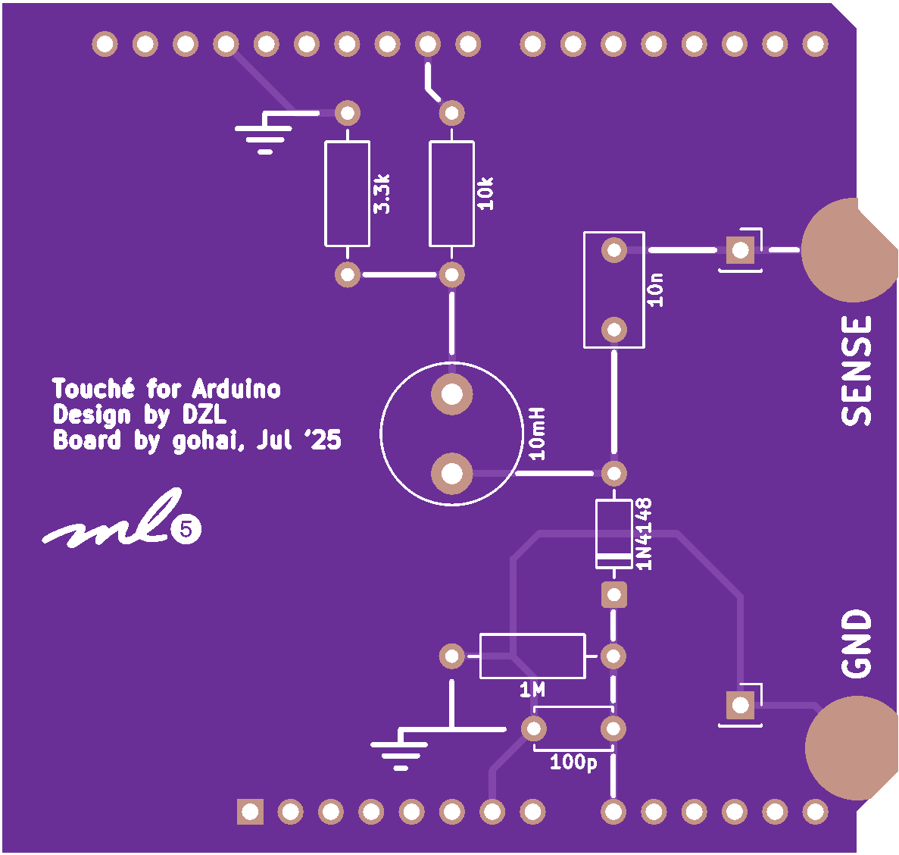

## Advanced touch sensing with ml5

👉 **Try the [p5.js example sketch](https://editor.p5js.org/gohai/sketches/TsMkm30Jv)!**

👉 **Watch the [video](https://www.youtube.com/watch?v=E4tYpXVTjxA)**

## Credits

Original research:

> Munehiko Sato, Ivan Poupyrev, and Chris Harrison. 2012. *Touché: enhancing touch interaction on humans, screens, liquids, and everyday objects.* In Proceedings of the SIGCHI Conference on Human Factors in Computing Systems (CHI '12). Association for Computing Machinery, New York, NY, USA, 483–492. [https://doi.org/10.1145/2207676.2207743](https://doi.org/10.1145/2207676.2207743)

Arduino port by [DZL](https://dzlsevilgeniuslair.blogspot.com/), Instructible by [Mads Hobye](https://www.instructables.com/Touche-for-Arduino-Advanced-touch-sensing/)

## Contributing

Contributions are welcome! 🎉
- Open a [PR](https://github.com/gohai/touch-ml5-kit/pulls) or [Issue](https://github.com/gohai/touch-ml5-kit/issues/new/choose) with improvements, experiments, or fixes.
- Links to p5 Web Editor sketches are especially appreciated
